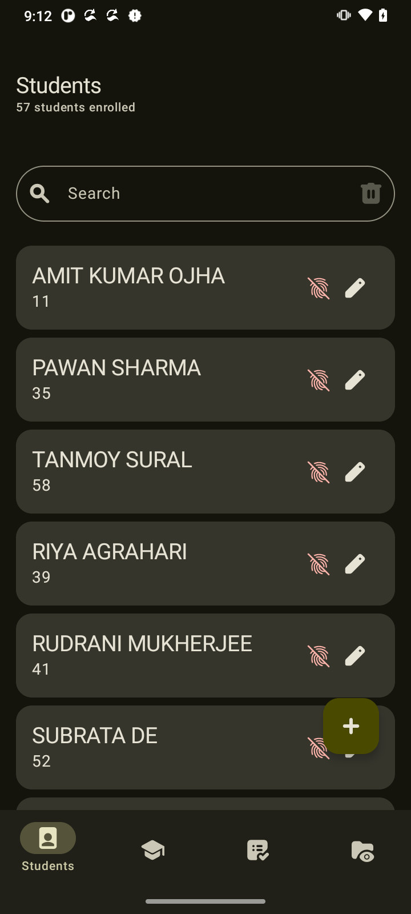
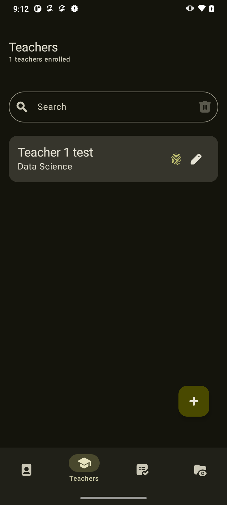
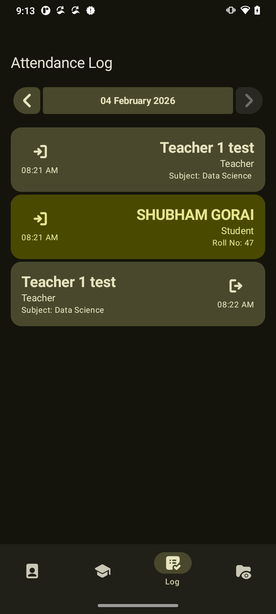
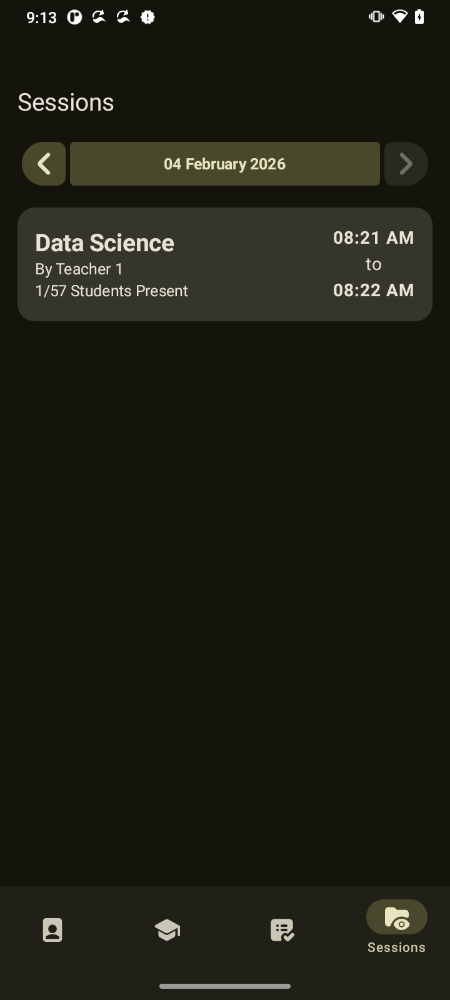

# RpiAttendance

Kotlin/Native server to manage attendance on a raspberry pi 4B
from a python server managing biometric sensors and camera.

## Screenshots of Client App

|  |  |
|:-----------------------:|:-----------------------:|
|  |  |

## Requirements
- Raspberry pi (Used in this project is 4B 8gb variant)
- R307 fingerprint scanner with UART to USB Converter
- ssd1305 OLED Display 
- Raspberry pi camera
- 4x4 matrix membrane keypad
- Jumper cables and power adapter

## Setup
Required OS for Raspberry pi: `Debian GNU/Linux 12 (bookworm) aarch64`

### Setup Sensor Server
- Clone the repo at the home directory
```shell
git clone https://github.com/shub39/RpiAttendance
```
- Install [uv package manager](https://docs.astral.sh/uv/getting-started/installation/)
- Setup the server environment
```shell
# Setup
cd RpiAttandance/sensor_server/
uv venv
uv pip install

sudo apt update
sudo apt upgrade
sudo apt install pip python3-opencv python3-numpy cmake
sudo apt install libkms++-dev libfmt-dev libdrm-dev # might require more...

uv pip install rpi-libcamera -C setup-args="-Dversion=unknown"
uv pip install -r requirements.txt
```
- Setup the cronjob to run server on reboot, file `cronjob.sh`

### Setup Server Binary
- Download the binary from [releases](https://github.com/shub39/RpiAttendance/releases) to the home directory
- Setup cronjob
- Install android app on a device in the same network as the Raspberry Pi

### Building from Source

To build the project from source, you can use the following Gradle commands:

- **Build the native server:** `./gradlew :server:nativeMain`
- **Build the Android app:** `./gradlew :androidApp:assembleRelease`
- **Run the Desktop app:** `./gradlew :desktopApp:run`

## Project Structure
- `sensor_server` : throughly tested python server to manage the sensors using fastapi
- `core` : shared kotlin models and interfaces throughout the project
- `server` : Kotlin/Native server, the main server to connect with the client app. Manages connection to the `sensor_server` and database. Processes business logic
- `client` : UI and logic for the client app
- `androidApp` : Build module for the Android App
- `desktopApp` : Build Module for the Desktop App, Also for hot reload

## API Reference

The server exposes the following RPC methods through the `AdminInterface`:

| Method                                                               | Description                                                                                                               |
|----------------------------------------------------------------------|---------------------------------------------------------------------------------------------------------------------------|
| `getStatus(): Boolean`                                               | Checks if the server is responsive.                                                                                       |
| `getStudents(): Flow<List<Student>>`                                 | Provides a real-time stream of all students in the database.                                                              |
| `getTeachers(): Flow<List<Teacher>>`                                 | Provides a real-time stream of all teachers in the database.                                                              |
| `getDetailedAttendanceLogs(): Flow<List<DetailedAttendanceLog>>`     | Provides a real-time stream of all attendance logs, including details for the associated student or teacher.              |
| `getSessionsForDate(date: LocalDate): List<Session>`                 | Retrieves all attendance sessions that occurred on a specific date.                                                       |
| `upsertStudent(student: Student)`                                    | Creates a new student or updates an existing one.                                                                         |
| `upsertTeacher(teacher: Teacher)`                                    | Creates a new teacher or updates an existing one.                                                                         |
| `deleteStudent(student: Student)`                                    | Deletes a student and their associated biometric data.                                                                    |
| `deleteTeacher(teacher: Teacher)`                                    | Deletes a teacher and their associated biometric data.                                                                    |
| `deleteAttendanceLog(attendanceLog: AttendanceLog)`                  | Deletes a specific attendance log entry.                                                                                  |
| `addBiometricDetailsForStudent(student: Student): Flow<EnrollState>` | Initiates the biometric enrollment process (fingerprint and face) for a student. Returns a flow of the enrollment status. |
| `addBiometricDetailsForTeacher(teacher: Teacher): Flow<EnrollState>` | Initiates the biometric enrollment process for a teacher. Returns a flow of the enrollment status.                        |

## Database Schemas

The database is built using Room and has three tables:

**1. `students`**

This table stores information about the students.

| Column         | Type    | Description                                      |
|----------------|---------|--------------------------------------------------|
| `id`           | INTEGER | Primary key for the student.                     |
| `biometricId`  | TEXT    | The ID from the biometric scanner.               |
| `firstName`    | TEXT    | The first name of the student.                   |
| `lastName`     | TEXT    | The last name of the student.                    |
| `rollNo`       | INTEGER | The roll number of the student.                  |
| `contactEmail` | TEXT    | The email address of the student.                |
| `contactPhone` | TEXT    | The phone number of the student.                 |

**2. `teachers`**

This table stores information about the teachers.

| Column          | Type    | Description                           |
|-----------------|---------|---------------------------------------|
| `id`            | INTEGER | Primary key for the teacher.          |
| `biometricId`   | TEXT    | The ID from the biometric scanner.    |
| `firstName`     | TEXT    | The first name of the teacher.        |
| `lastName`      | TEXT    | The last name of the teacher.         |
| `subjectTaught` | TEXT    | The subject that the teacher teaches. |

**3. `attendance_log`**

This table stores the attendance logs for both students and teachers.

| Column             | Type    | Description                                   |
|--------------------|---------|-----------------------------------------------|
| `id`               | INTEGER | Primary key for the attendance log.           |
| `biometricId`      | TEXT    | The ID from the biometric scanner.            |
| `entityType`       | TEXT    | The type of entity (`STUDENT` or `TEACHER`).  |
| `entityId`         | INTEGER | The ID of the entity (student or teacher).    |
| `timeStamp`        | INTEGER | The timestamp of the attendance log.          |
| `attendanceStatus` | TEXT    | The status of the attendance (`IN` or `OUT`). |


## Tech stack

- **Framework:** [Kotlin Multiplatform](https://kotlinlang.org/docs/multiplatform.html)
- **UI:** [Jetpack Compose for Multiplatform](https://www.jetbrains.com/lp/compose-multiplatform/) for building the UI for Android, and Desktop.
- **Server:** [Ktor](https://ktor.io/) for the server-side application, with [Kotlinx RPC](https://github.com/Kotlin/kotlinx-rpc) for type-safe remote procedure calls between the client and server.
- **Database:** [Room](https://developer.android.com/training/data-storage/room) for the local database on the server.
- **Dependency Injection:** [Koin](https://insert-koin.io/) for dependency injection.
- **Asynchronous Programming:** [Kotlin Coroutines](https://kotlinlang.org/docs/coroutines-overview.html) for managing background threads and asynchronous operations.
- **Serialization:** [Kotlinx Serialization](https://github.com/Kotlin/kotlinx.serialization) for serializing and deserializing data between the client and server.

## License

This project is licensed under the MIT License. See the [LICENSE](LICENSE) file for details.
