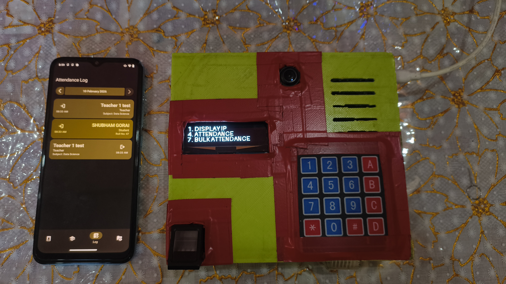
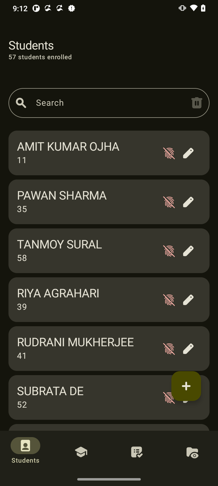
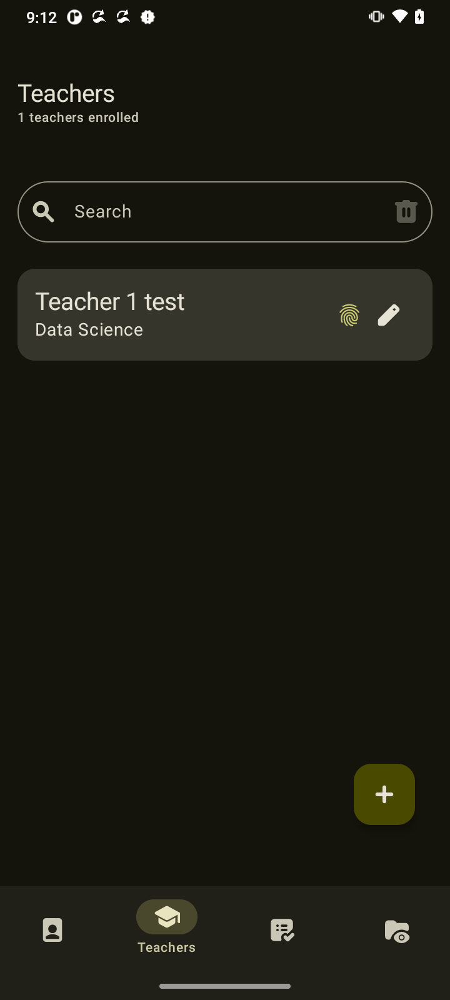
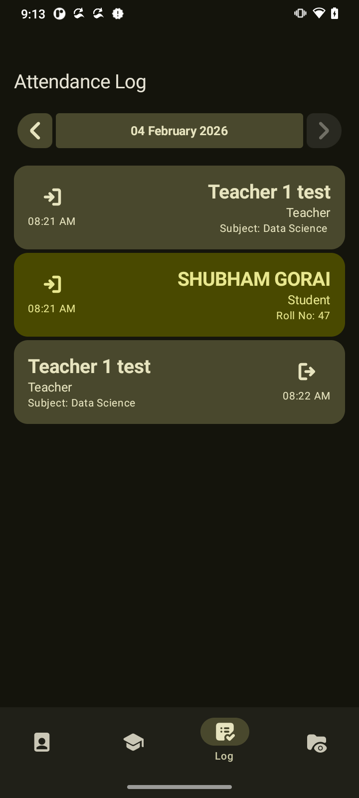
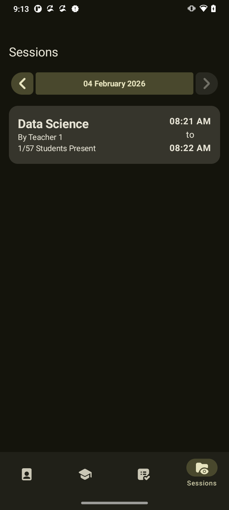
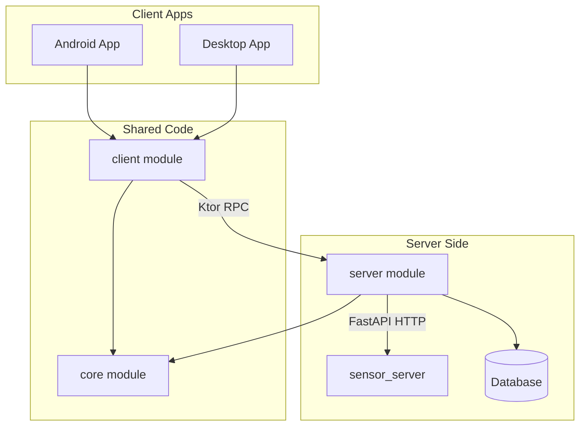

# RpiAttendance
Kotlin/Native server to manage attendance on a raspberry pi 4B
from a python server managing biometric sensors and camera.

## Pic


## Screenshots of Client App
|  |  |
|:-----------------------:|:-----------------------:|
|  |  |

Also made a [Youtube Video](https://www.youtube.com/watch?v=sc254TMSav4) talking about this project

## Requirements
- Raspberry pi (Used in this project is 4B 8gb variant)
- R307 fingerprint scanner with UART to USB Converter
- ssd1305 OLED Display 
- Raspberry pi camera
- 4x4 matrix membrane keypad
- Jumper cables and power adapter

## Setup
Required OS for Raspberry pi: `Debian GNU/Linux 12 (bookworm) aarch64`

### Setup Sensor Server
- Clone the repo at the home directory
```shell
git clone https://github.com/shub39/RpiAttendance
```
- Install [uv package manager](https://docs.astral.sh/uv/getting-started/installation/)
- Setup the server environment
```shell
# Setup
cd RpiAttandance/sensor_server/
uv venv
uv pip install

sudo apt update
sudo apt upgrade
sudo apt install pip python3-opencv python3-numpy cmake
sudo apt install libkms++-dev libfmt-dev libdrm-dev # might require more...

uv pip install rpi-libcamera -C setup-args="-Dversion=unknown"
uv pip install -r requirements.txt
```
- Setup the cronjob to run server on reboot, file `cronjob.sh`

### Setup Server Binary
- Download the binary from [releases](https://github.com/shub39/RpiAttendance/releases) to the home directory
- Setup cronjob
- Install android app on a device in the same network as the Raspberry Pi

### Building from Source

To build the project from source, you can use the following Gradle commands:

- **Build the native server:** `./gradlew :server:linkReleaseExecutableLinuxArm64`
- **Build the Android app:** `./gradlew :androidApp:assembleRelease`
- **Run the Desktop app:** `./gradlew :desktopApp:run`

## Project Structure
- `sensor_server` : throughly tested python server to manage the sensors using fastapi
- `core` : shared kotlin models and interfaces throughout the project
- `server` : Kotlin/Native server, the main server to connect with the client app. Manages connection to the `sensor_server` and database. Processes business logic
- `client` : UI and logic for the client app
- `androidApp` : Build module for the Android App
- `desktopApp` : Build Module for the Desktop App, Also for hot reload

## Architecture

```mermaid
graph TD
    subgraph "Client Apps"
        androidApp[Android App]
        desktopApp[Desktop App]
    end
    subgraph "Shared Code"
        client[client module]
        core[core module]
    end
    subgraph "Server Side"
        server[server module]
        sensor_server[sensor_server]
        db[(Database)]
    end
    androidApp --> client
    desktopApp --> client
    client --> core
    client -- Ktor RPC --> server
    server --> core
    server -- FastAPI HTTP --> sensor_server
    server --> db
```

## Tech stack

- **Framework:** [Kotlin Multiplatform](https://kotlinlang.org/docs/multiplatform.html)
- **UI:** [Jetpack Compose for Multiplatform](https://www.jetbrains.com/lp/compose-multiplatform/) for building the UI for Android, and Desktop.
- **Server:** [Ktor](https://ktor.io/) for the server-side application, with [Kotlinx RPC](https://github.com/Kotlin/kotlinx-rpc) for type-safe remote procedure calls between the client and server.
- **Database:** [Room](https://developer.android.com/training/data-storage/room) for the local database on the server.
- **Dependency Injection:** [Koin](https://insert-koin.io/) for dependency injection.
- **Asynchronous Programming:** [Kotlin Coroutines](https://kotlinlang.org/docs/coroutines-overview.html) for managing background threads and asynchronous operations.
- **Serialization:** [Kotlinx Serialization](https://github.com/Kotlin/kotlinx.serialization) for serializing and deserializing data between the client and server.

## License

This project is licensed under the GPL-3.0 License. See the [LICENSE](LICENSE) file for details.
